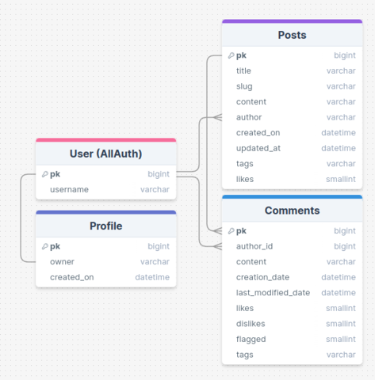
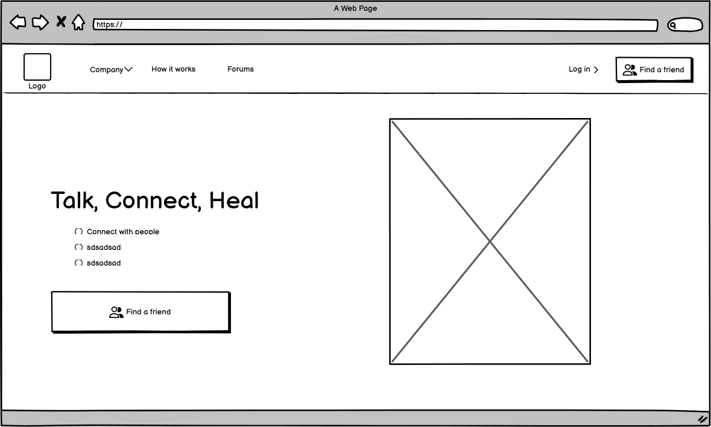
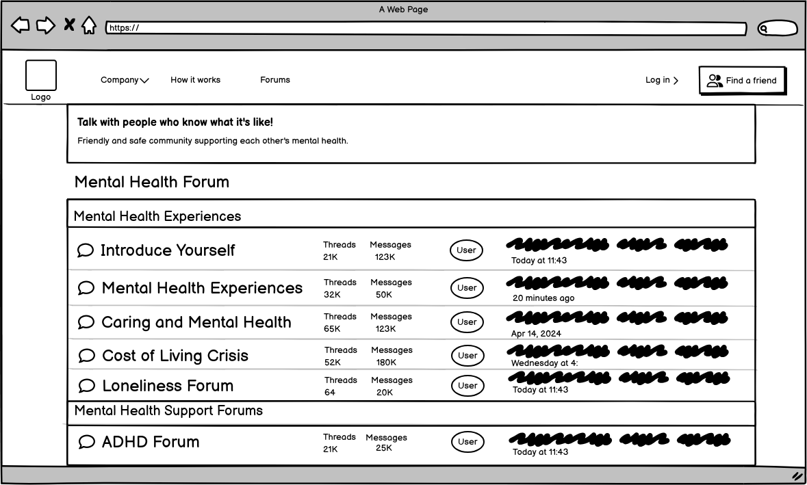
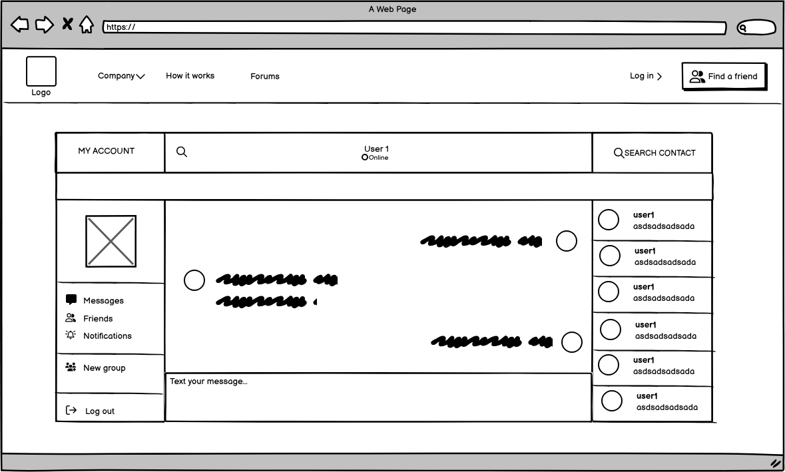
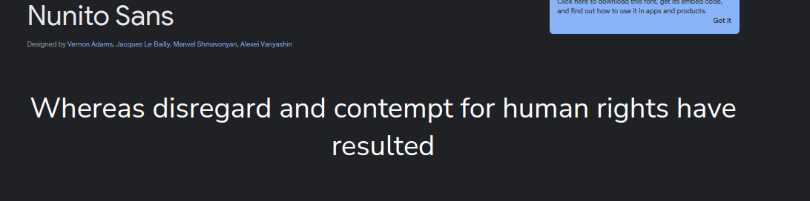
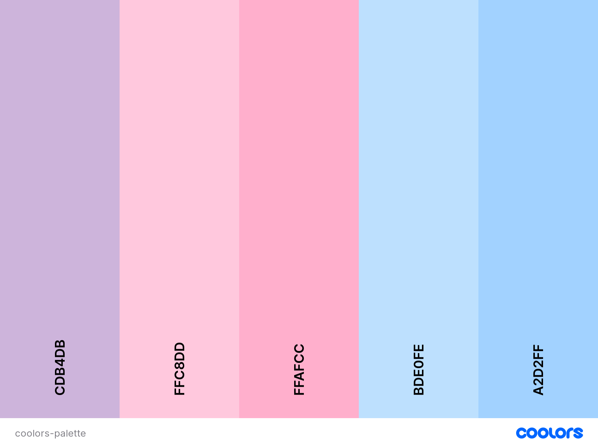
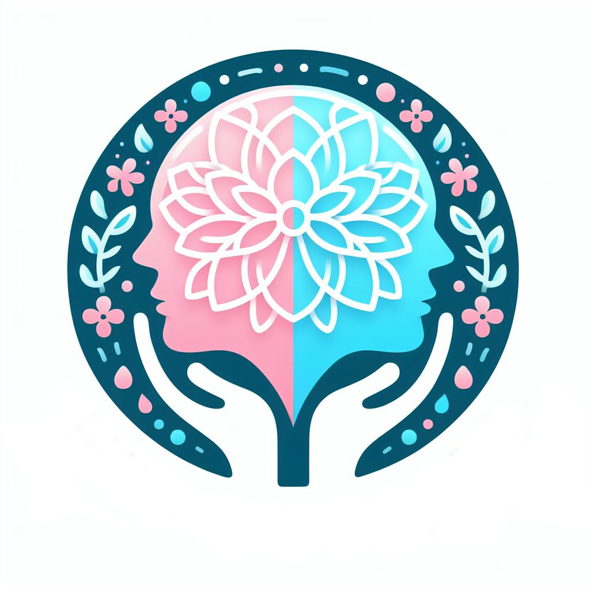
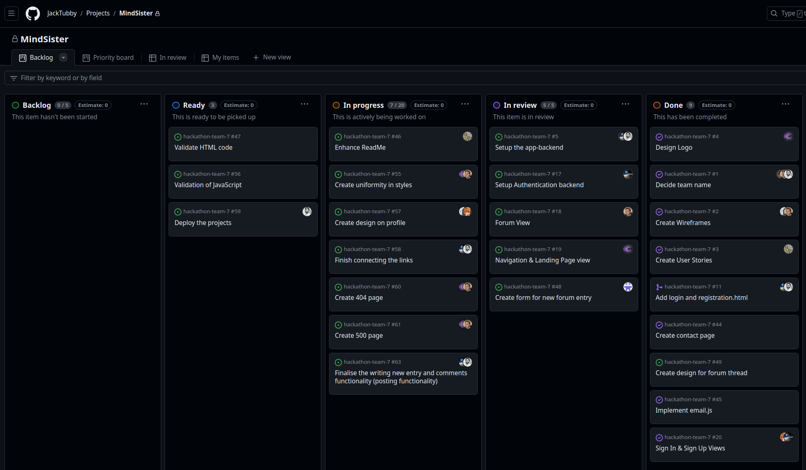

# MIND SISTER

[Link to the deployed site]()

# Project Overview

Mind Sister recognises women's specific needs when dealing with mental disorders and offers a platform where women can easily express themselves and reach out for help.

<strong>Main Feature</strong>: Mental Health Forums

This platform was built using Django, Python, HTML and CSS. The site was deployed on Heroku.

Mind Sister is Team 7 Mindful Coders' project submission for Code Institute's "Women's Health Reimagined" hybrid hackathon in London, April 2024.

## Meet the Development Team
- [Destan](https://github.com/DestanT) - Scrum Master | Backend

- [Jack](https://github.com/JackTubby) - Backend

- [Mikaela](https://github.com/mikavir) - Frontend

- [Istem](https://github.com/techistem) - Content

- [Taher](https://github.com/TaherCCG) - Frontend | Wireframes | Imagery

- [Lydia](https://github.com/Lydiajoy97) - Backend

- [Ren](https://github.com/Discoveren) - Frontend | Wireframes 

- [Karina](https://github.com/kkumyk) - Documentation


### TABLE OF CONTENTS
- [User Experience](#user-experience)
    - [Strategy Plane](#strategy-plane)
    - [Scope Plane](#scope-plane)
    - [Structure Plane](#structure-plane)
        - [Database Design](#database-design)
        - [User Stories](#user-stories)
    - [Skeleton Plane](#skeleton-plane)
        - [Wireframes](#wireframes)
    - [Surface Plane](#surface-plane)
        - [Typography](#typography)
        - [Colour Palette](#colour-palette)
        - [Imagery](#imagery)
- [Agile Methodology](#agile-methodology)
- [Technologies Used](#technologies-used)
  - [Languages Used](#languages-used)
  - [Frameworks Used](#frameworks-used)
  - [Databases Used](#databases-used)
  - [Libraries and Packages Used](#libraries-and-packages-used)
  - [Programmes and Applications](#programmes-and-applications)
  - [Cloud Application Platforms Used](#cloud-application-platforms-used)
  - [Cloud Storage Services Used](#cloud-storage-services-used)
<!-- - [Future Development](#future-development) -->
- [Credits](#credits)
- [Internal Docs](#internal-docs)

<hr>

# User Experience

## Strategy Plane

[Research shows ](https://www.bma.org.uk/media/2115/bma-womens-mental-health-report-aug-2018.pdf) that there are differences between women and men in how they express mental distress. This is seen in the prevalence of common mental disorder such as anxiety and depression, self-harm, substance misuse and suicide; pathways into treatment and support and in therapeutic preferences. Current gender neutral approaches to service provision fail to recognise the specific needs of women. If health care truly is to be personalised, it must respond appropriately to gendered differences in mental health:

- 1:6 adults (17.0%) had a common mental disorder.
- 1:5 women (20.7%) compared with 1:8 men (13.2%).
- the rate is largely stable in men compared with a steady increase in women.
- 1:5 16-25yr women report recent self-harm.
- Suicide rates in women are at their highest for a decade.

<!-- ### Project Goals

This section aims to answer the key question: What problems are we trying to solve with MindSister?  -->

## Scope Plane
When planning the Mind Sister's features and scope, we drew up a Desirability, Importance and Viability analysis of all the features to be included in the project, and ranked each of these by order of importance from low (1) to high (5). The features that ranked the highest will be prioritised and delivered as part of the MVP.

<table>
<thead>
<tr>
<th>#</th>
<th>Feature</th>
<th>Target User</th>
<th>Desirability</th>
<th>Importance</th>
<th>Viability</th>
<th>Delivered</th>
</tr>
</thead>
<tbody>
<tr>
<td>User Accounts</td>
<td></td>
<td></td>
<td></td>
<td></td>
<td></td>
<td></td>
</tr>
<tr>
<td>1</td>
<td>User Role Permissions</td>
<td>All Users <sup>1</sup></td>
<td>5</td>
<td>5</td>
<td>5</td>
<td>✅</td>
</tr>
<tr>
<td>2</td>
<td>Account Registration</td>
<td>All Users <sup>1</sup></td>
<td>5</td>
<td>5</td>
<td>5</td>
<td>✅</td>
</tr>
<tr>
<td>3</td>
<td>User Profile Page</td>
<td>Registered Users</td>
<td>5</td>
<td>5</td>
<td>5</td>
<td>✅</td>
</tr>
<tr>
<td>Navigation</td>
<td></td>
<td></td>
<td></td>
<td></td>
<td></td>
<td></td>
</tr>
<tr>
<td>4</td>
<td>Top Navigation to include: logo and my account (register, login)</td>
<td>All Users <sup>1</sup></td>
<td>5</td>
<td>5</td>
<td>5</td>
<td>✅</td>
</tr>

<td>Profiles</td>
<td></td>
<td></td>
<td></td>
<td></td>
<td></td>
<td></td>
</tr>
<tr>
<td>5</td>
<td>User Profile page</td>
<td>All Users <sup>1</sup></td>
<td>5</td>
<td>5</td>
<td>5</td>
<td>✅</td>
</tr>
<td>Forum</td>
<td>Topic page</td>
<td>Registered Users</td>
<td>5</td>
<td>5</td>
<td>5</td>
<td>✅</td>
</tr>

</tbody>
</table>

1. All Users: site visitors and logged in users

## Structure Plane

### Database Design

#### Entity Relationship Diagram

An ER diagram visualises the relationships between entities like people, things, or concepts in a database. The relationships between these entities are then mapped and identified.

The data model type used for this project is the Relational Model.

- <strong>User Model</strong>
  - The User model is a component of Django's Authentication system and contains information about the user.
  - The User model contains the following fields: username.

- <strong>Profile Model</strong>
  - The Profile model contains the following fields: owner, create_on

- <strong>Posts Model</strong>
  - The Posts model contains the following fields: title, slug, content, author, create_on, updated_at, tags, likes.
  - It uses author as a foreignkey.

- <strong>Comments Model</strong>
  - The Comments model contains the following fields: author_id, content, creation_date, last_modified_date, likes, dislikes, flagged, tags.
  - It uses author_id as a foreignkey.




### User Stories

<table>
<thead>
<tr>
<th>#</th>
<th>Target User</th>
<th>User Story</th>
</tr>
</thead>
<tbody>
<tr>
<td>VIEWING &amp; NAVIGATION</td>
<td></td>
<td></td>
</tr>
<tr>
<td>1</td>
<td>Visitor</td>
<td>I want to be able to navigate around the site and understand how it can benefit me.</td>
</tr>
<tr>
<td>2</td>
<td>Visitor</td>
<td>I want to be able to navigate around the site to learn more about the team behind the site and confirm that this site is valid and secure to use and how users' personal information is handled on the site.</td>
</tr>
<tr>
<td>3</td>
<td>Visitor</td>
<td>I can click on Register button on Home Page so that I can navigate to Registration Page.</td>
</tr>
<tr>
<td>4</td>
<td>Visitor</td>
<td>on the Registration Page I can fill a form with my name, e-mail address and phone number so that I can create an account as a user.</td>
</tr>
<td>REGISTRATION &amp; USER ACCOUNTS</td>
<td></td>
<td></td>
</tr>
<tr>
<td>5</td>
<td>User</td>
<td>I can easily register for an account, be able to view my profile and control what information about me other users can see.</td>
</tr>
<tr>
<td>6</td>
<td>User</td>
<td>after registration I will appear among the registered users and can start communicating with them.</td>
</tr>
<tr>
<td>7</td>
<td>User</td>
<td>after registration I will have options to start a thread on the Forum page and leave comments on the existing pages.</td>
</tr>
</tbody>
</table>


## Skeleton Plane

### Wireframes

<details>
  <summary>Initial Wireframes</summary>







</details>

<hr>
The initial wireframes in the above section were created based on the idea of building a Buddy System for women experiencing mental health problems. However, we identified that there are several issues with this idea that can potentially create more problems instead of solving them. The project's idea had to be changed, and so did the wireframes:

#### Visitor


<hr>

#### Registered User


## Surface Plane

### Typography
Typography Nunito Sans will be used throughout the site.


### Colour Palette



### Imagery
<strong>Mind Sister's Logo</strong>



<hr>

# Agile Methodology
GitHub Projects was used to manage the development of the site:



<hr>

# Technologies Used

## Languages Used

- [HTML5](https://en.wikipedia.org/wiki/HTML5) was used for the content and structure of the site.
- [CSS3](https://en.wikipedia.org/wiki/CSS) was used for the styling of the site.
- [Python](https://en.wikipedia.org/wiki/CSS) was used for the back end programming of the site.

## Frameworks Used
- [DJANGO](https://www.djangoproject.com/) v4.2.11 Django is a free and open-source, Python-based web framework that follows the model–template–views architectural pattern.

## Databases Used

- [ElephantSQL](https://www.elephantsql.com/)'s Postgres as a Service was used to host the database for the project.

## Libraries and Packages Used
- [asgiref](https://pypi.org/project/asgiref/) provides two wrappers that let you go between asynchronous and synchronous code.
- [astroid](https://pylint.pycqa.org/projects/astroid/en/latest/) provides a common base representation of python source code.
- [certifi](https://pypi.org/project/certifi/) validates the trustworthiness of SSL certificates while verifying the identity of TLS hosts.
- [charset-normalizer](https://pypi.org/project/charset-normalizer/) helps you read text from an unknown charset encoding.
- [django-allauth](https://docs.allauth.org/en/latest/) is an integrated set of Django applications dealing with account authentication, registration, management, and third-party (social) account authentication.
- [django-cloudinary-storage](https://pypi.org/project/django-cloudinary-storage/) facilitates integration with Cloudinary by implementing Django Storage API. 
- [django-crispy-forms](https://django-crispy-forms.readthedocs.io/en/latest/) defines the form rendering behavior.
- [gunicorn](https://gunicorn.org/) is a Python WSGI HTTP Server that allows us to run any Python application concurrently by running multiple processes within a single dyno.
- [idna](https://pypi.org/project/idna/) a library to support the Internationalised Domain Names in Applications (IDNA) protocol.
- [pillow](https://pypi.org/project/pillow/) is a required Python imaging library used to enable handling of images.
- [pylint](https://pylint.readthedocs.io/en/stable/) used for errors checking and testing.
- [pylint-plugin-utils](https://pypi.org/project/pylint-plugin-utils/) utilities and helpers for writing Pylint plugins.
- [psycopg2](https://pypi.org/project/psycopg2/) is a postgresql database adapter for python and used to connect with our postgres database.
- [requests](https://www.w3schools.com/python/module_requests.asp) allows you to send HTTP requests using Python.
- [sqlparse](https://pypi.org/project/sqlparse/) provides support for parsing, splitting and formatting SQL statements.
- [tomli](https://github.com/hukkin/tomli) is a Python library for parsing TOML.
- [tomlkit](https://github.com/python-poetry/tomlkit) preserves all comments, indentations, whitespace and internal element ordering, and makes them accessible and editable via an intuitive API.
- [typing_extensions](https://typing-extensions.readthedocs.io/en/latest/) enables use of new type system features on older Python versions.
- [urllib3](https://github.com/urllib3/urllib3) is a HTTP client for Python.
- [whitenoise](https://whitenoise.readthedocs.io/en/latest/) allows your web app to serve its own static files.

## Programmes and Applications
- [Balsamiq](https://balsamiq.com/) used to create wireframes.
- [Git](https://git-scm.com/) used for version control and saving work in the repository to commit to GitHub.
- [GitHub](https://github.com/) is the project's git repository.
- [GitHub Projects](https://docs.github.com/en/issues/planning-and-tracking-with-projects/learning-about-projects/about-projects) used to track and integrate issues for Agile Development.
- [Chrome DevTools](https://developer.chrome.com/docs/devtools) was used for debugging, validation (Lighthouse) and taking fullscreen screenshots of the site.

## Cloud Application Platforms Used
[Heroku](https://www.heroku.com/) was used for hosting and deployment of the live site.

## Cloud Storage Services Used
[Cloudinary](https://cloudinary.com/) was used to store user profile images.

# Deployment and Local Deployment

## Local Deployment

### Obtaining EmailJS API

1. Sign up for a [EmailJS](https://www.emailjs.com/docs/) account in the EmailJS website.
2. Create an email service in your EmailJS dashboard.
3. Install EmailJS Library. You can do this by including the EmailJS script in your HTML file or by installing it via npm if you're using a package manager like npm or yarn.

```
npm install --save @emailjs/browser
```
or
```
$ yarn add @emailjs/browser
```
1. In your EmailJS dashboard, navigate to the "API Keys" section and copy your API key.
2. Add this code snippet before your closing tags. Making sure you have added your public key.

```
<script type="text/javascript"
        src="https://cdn.jsdelivr.net/npm/@emailjs/browser@4/dist/email.min.js">
</script>
<script type="text/javascript">
  (function(){
      emailjs.init({
        publicKey: "YOUR_PUBLIC_KEY",
      });
  })();
</script>
```

<!-- # Future Development -->

<!-- ### Features

### Accessibility

## Deployment and Local Deployment

## Testing

## Bugs

### Known Bugs

### Solved Bugs -->


## Credits

#### Online sources used for research:

- [Addressing unmet needs in women’s mental health](https://www.bma.org.uk/media/2115/bma-womens-mental-health-report-aug-2018.pdf)

- [talkwomenshealth](https://www.talkhealthpartnership.com/talkwomenshealth/forums) forum

- [Mental Health Forum](https://www.mentalhealthforum.net/forum/)

- [Premenstrual dysphoric disorder (PMDD)](https://www.mind.org.uk/information-support/types-of-mental-health-problems/premenstrual-dysphoric-disorder-pmdd/about-pmdd/)

#### Documentation:
The README files from the projects below were used to structure the documentation of this project: 
- https://github.com/rachel-o-donnell/rising-women
- https://github.com/JoyZadan/shop-kbeauty

    
## Internal Docs
<details>
  <summary>Getting Started</summary>

VSCode users:
* You can clone this repo by going into your terminal and running the command `git clone "https://github.com/DestanT/hackathon-team-7"`

## Working with the project

### Keep Your Code Updated
Many people will be working on this repo so following these steps will help ensure that we keep our code in its own branches and we can merge it as we go.

### Start New Features on New Branches
* Regularly run git pull to ensure your local code is synchronized with the latest updates from the main branch.
* When beginning work on a new feature, create a new branch by using: - `git checkout -b "BRANCH NAME"` - This command switches you to a new branch dedicated to your feature.

### Commit Your Changes Incrementally
* As you develop the feature, think about dividing the work into manageable parts. For each part, use the following commands to commit your changes to your branch: 
`
git add .
`
`
git commit -m "Brief description of changes"
`
`
git push
`
This sequence stages your changes, commits them with a brief message, and pushes them to your branch on GitHub.

### Create a Pull Request When Ready
Once your feature is complete and ready for integration, initiate a pull request:
* Go to the 'Pull Requests' tab in the GitHub repository.
* Click 'New Pull Request'.
* Select your feature branch and the main branch to merge into.
* Click 'Create Pull Request'.

Once you are ready to move on to the next feature run `git checkout main` to switch back to the main branch & then `git pull` to get the new changes and then follow the steps again.
</details>